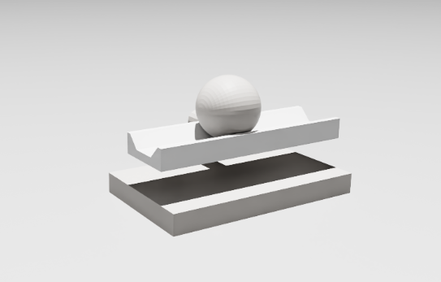

# Ball On Beam

这是一个按学习路径组织的平衡球入门项目：

- 前半部分用纯 Python 的 `helloworld` 示例帮助建立控制直觉；
- 中间部分把同一类问题落到 `ROS 2 + Gazebo Sim` 的仿真工作流里；
- 新增的 `isaacsim/` 目录则给出 Isaac Sim 里的两套平衡球 demo，方便继续对比不同仿真工具链的建模与控制接入方式。



## 仓库结构

- `helloworld/`: 控制算法入门示例，适合先理解控制思路，再看工程化实现。
- `ros2/a01_balance_1dof/`: 1 自由度平衡球机构的 URDF/Xacro、网格模型与 RViz 预览启动文件。
- `ros2/a01_balance_control/`: 闭环控制节点，订阅 `/joint_states`，发布轨道关节速度命令。
- `ros2/a01_balance_sim/`: Gazebo Sim 启动、`ros_gz_bridge` 桥接、模型生成与控制集成入口。
- `ros2/README.md`: ROS 2 仿真详细入门文档。
- `isaacsim/procedural_demo/`: 纯脚本生成横梁和小球的 Isaac Sim 版本，适合先理解场景搭建和控制闭环。
- `isaacsim/ros2_model_demo/`: 直接复用 `ros2/a01_balance_1dof` 模型的 Isaac Sim 版本，更贴近项目现有机械结构。
- `isaacsim/README.md`: Isaac Sim 总览文档，说明两个 demo 的关系、用途和运行方式。

## 推荐学习顺序

1. `helloworld/01_helloworld_pid`
   最基础的控制入门，用级联 PID 理解“位置误差 -> 倾角命令 -> 小球回中”的控制链路。
2. `helloworld/02_helloworld_lqr`
   从经验调参转向模型驱动控制，理解状态空间、权重矩阵和最优状态反馈。
3. `helloworld/03_helloworld_kalman`
   在只有位置测量时估计速度，建立“状态估计”概念，为真实系统落地做准备。
4. `helloworld/04_helloworld_lqg`
   把 `LQR` 和 `Kalman Filter` 结合起来，理解“先估计状态，再用估计状态控制”。
5. `helloworld/05_helloworld_mpc`
   进入带约束优化控制，适合理解输入限制、状态限制和预测控制的基本思路。
6. `helloworld/06_helloworld_adrc`
   面向模型不准和外扰的工程化控制方法，强调“估扰 + 补偿”的实际价值。
7. `helloworld/07_helloworld_disturbance_observer`
   用扰动观测器补偿未建模动态和外部扰动，适合理解鲁棒控制中的观测思路。
8. `helloworld/08_helloworld_smc`
   滑模控制入门，重点理解对不确定性的鲁棒性，以及抖振带来的工程权衡。
9. `helloworld/09_helloworld_backstepping`
   面向非线性系统设计控制律，帮助从线性化思路过渡到原始非线性模型设计。
10. `ros2/`
   把前面的控制思路迁移到机器人仿真环境，理解模型描述、话题桥接、控制节点和启动文件之间如何协同工作。
11. `isaacsim/`
   在 Isaac Sim 里继续做平衡球仿真，并对比两种实现路径：
   - `procedural_demo/`：先用简化场景理解 Isaac Sim 中的控制闭环；
   - `ros2_model_demo/`：再把项目已有 ROS2 模型真正接入 Isaac Sim。

## 快速开始

### 1. 先看算法小例子

直接进入 `helloworld/` 对应目录运行 Python 示例即可。建议配合每个目录下的 `about.md` 一起阅读。

### 2. 再运行 ROS 2 + Gazebo 仿真

在工作区 `ros2/` 下构建并启动仿真：

```bash
cd ros2
colcon build
source install/setup.bash
ros2 launch a01_balance_sim sim.launch.py
```

这条启动命令会同时完成几件事：

- 打开 Gazebo Sim 世界；
- 通过 `robot_state_publisher` 发布机器人描述；
- 用 `ros_gz_sim` 将平衡球模型生成到仿真中；
- 用 `ros_gz_bridge` 桥接 `/clock`、`/imu`、`/joint_states` 和关节速度命令；
- 启动 `a01_balance_control` 中的闭环控制器。

如果你想先只看 URDF/关节结构，也可以运行：

```bash
cd ros2
source install/setup.bash
ros2 launch a01_balance_1dof launch.py
```

### 3. 最后看 Isaac Sim 版本

如果你已经熟悉前面的 `helloworld` 和 `ROS 2` 部分，可以继续看 `isaacsim/`。

推荐顺序是：

- 先看 `isaacsim/procedural_demo/`
  - 这一版完全由脚本生成横梁和小球，适合理解 Isaac Sim 里的场景构建、状态读取和控制闭环；
- 再看 `isaacsim/ros2_model_demo/`
  - 这一版直接复用 `ros2/a01_balance_1dof` 的 `xacro/URDF/mesh`，更接近真实项目接入。

程序化版本运行方式：

```bash
conda activate isaac
python isaacsim/procedural_demo/ball_balance_demo.py
```

ROS2 模型版本运行方式：

```bash
conda activate isaac
python isaacsim/ros2_model_demo/ball_balance_ros2_model_demo.py
```

## ROS 2 仿真里有什么

当前仿真链路对应的是一个典型的“感知-估计-控制-执行”闭环：

- Gazebo Sim 提供球和轨道的动力学仿真；
- `/joint_states` 提供轨道角度、轨道角速度、小球位置和小球速度；
- `a01_balance_control` 对状态做一阶低通滤波，并用双层 PD 风格控制计算轨道速度命令；
- 控制命令通过 `/model/a01_balance/joint/joint_track/cmd_vel` 发回仿真执行器。

## Isaac Sim 里有什么

`isaacsim/` 现在不是单一 demo，而是两套用途不同的实现：

- `procedural_demo/`
  - 适合教学和快速实验；
  - 不依赖现有 ROS2 模型资产；
  - 更容易先把控制和调参直觉建立起来。
- `ros2_model_demo/`
  - 适合继续贴近项目真实模型；
  - 通过 `xacro -> URDF -> Isaac Sim importer` 导入 `a01_balance_1dof`；
  - 控制对象是真实导入后的 `joint_track` 和 `joint_ball`。

可以把它们理解成：

- `procedural_demo/` 解决“先在 Isaac Sim 里把问题讲清楚”
- `ros2_model_demo/` 解决“把项目现有模型接进 Isaac Sim 也跑起来”

## 文档入口

- ROS 2 仿真详细说明见 [ros2/README.md](/home/umas/prj/diy014f_sim_ball_on_beam/ros2/README.md)
- Isaac Sim 版本说明见 [isaacsim/README.md](/home/umas/prj/diy014f_sim_ball_on_beam/isaacsim/README.md)
- Isaac Sim 程序化版本详细文档见 [isaacsim/procedural_demo/README.md](/home/umas/prj/diy014f_sim_ball_on_beam/isaacsim/procedural_demo/README.md)
- Isaac Sim ROS2 模型版本详细文档见 [isaacsim/ros2_model_demo/README.md](/home/umas/prj/diy014f_sim_ball_on_beam/isaacsim/ros2_model_demo/README.md)

## 适合谁

- 想从经典控制入门，一步步过渡到机器人系统实现的人；
- 想把 `PID / LQR / Kalman / LQG / MPC` 等概念和一个具体对象联系起来的人；
- 想学习 `ROS 2 + Gazebo Sim + ros_gz_bridge` 基本工作流的人；
- 想对比 `Gazebo Sim` 和 `Isaac Sim` 两套仿真链路的人。
